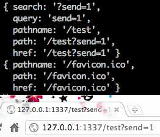

************
Node.js 基礎
************

前篇文章已經由介紹、安裝至設定都有完整介紹，nodeJS 內部除了javascript 常用的函式(function)、物件(object)之外，也有許多不同的自訂物件，nodeJS 預設建立這些物件為核心物件，是為了要讓開發流程更為，這些資料在官方文件已經具有許多具體說明。接下來將會介紹在開發nodeJS 程式時常見的物件特性與使用方法。

node.js http 伺服器建立
=======================

在`node.js官方網站 <http://nodejs.org>`裡面有舉一個最簡單的HTTP 伺服器建立，一開始初步就是建立一個伺服器平台，讓node.js 可以與瀏覽器互相行為。每種語言一開始的程式建立都是以 Hello world 開始，最初也從Hello world 帶各位進入node.js 的世界。

輸入以下程式碼，儲存檔案為 node_basic_http_hello_world.js 

.. literalinclude:: ../src/node_basic_http_hello_world.js
   :language: javascript

程式碼解講，一開始需要有幾個基本的變數。
 * ip: 機器本身的ip 位置，因為使用本地端，因此設定為127.0.0.1
 * port: 需要開通的阜號，通常設定為http port 80，因範例不希望與基本port 相衝，隨意設定為1337

在node.js 的程式中，有許多預設的模組可以使用，因此需要使用require 方法將模組引入，在這邊我們需要使用http這個模組，因此將http載入。Http 模組裡面內建有許多方法可以使用，這邊採用createServer 創建一個基本的http 伺服器，再將http 伺服器給予一個server 變數。裡面的回呼函式(call back function)可以載入http 伺服器的資料與回應方法(request, response)。在程式裡面就可以看到我們直接回應給瀏覽器端所需的 Header，回應內容。

.. code-block:: javascript

    res.writeHead(200, {'Content-Type': 'text/plain'});
    res.end('Hello World\n');

Http 伺服器需要設定port, ip，在最後需要設定Http 監聽，需要使用到 listen 事件，監聽所有Http 伺服器行為。

.. code-block:: javascript

    http.listen(port, ip);

所有事情都完成之後，需要確認伺服器正確執行因此使用console，在javascript 裡就有這個原生物件，console所印出的資料都會顯示於node.js 伺服器頁面，這邊印出的資料並不會傳送到使用者頁面上，之後許多除壞(debug) 都會用到console 物件。

.. code-block:: javascript

    console.log("Server running at http://" + ip + ":" + port);

node.js http 路徑建立 
=====================

前面已經介紹如何建立一個簡單的http 伺服器，接著需要處理一些伺服器要求(request)處理，在http的協定下，所有從瀏覽器發出的要求都需要經過處理，在路徑上的建立也是如此。這個章節將會解說如何處理路徑問題(routing issue)。

路徑就是指伺服器 ip 位置，或者是網域名稱之後，對於伺服器給予的要求。修改剛才的hello world 檔案，修改如下。

.. code-block:: javascript

	server = http.createServer(function (req, res) {
	  console.log(req.url);
	  res.writeHead(200, {'Content-Type': 'text/plain'});
	  res.end('hello world\n');
	});

重新啟動node.js 程式後，在瀏覽器端測試一下路徑行為，結果如下圖，當在瀏覽器輸入http://127.0.0.1:1337/test ，在伺服器端會收到兩個要求，一個是我們輸入的/test 要求，另外一個則是 /favicon.ico。

.. image:: ../images/zh-tw/node_basic_rout_test.png
   :scale: 100%
   :align: center

最後面這段/test 的要求，http 伺服器本身需要經過程式設定才有辦法回應給瀏覽器端所需要的回應，在伺服器中所有的路徑要求都是需要被解析才有辦法取得資料的。因此在node.js 當中所有的路徑都需要經過設定，未經過設定的路由會讓瀏覽器無法取得任何資料導致錯誤頁面的發生，底下將會解說如何設定路由，同時避免發生錯誤情形。

接下來剛才的檔案需要經過程式判別，這樣才能讓使用者透過瀏覽器，瀏覽不同路徑時。根據剛才的程式做如下的修改，

.. literalinclude:: ../src/node_basic_http_rout_done.js
   :language: javascript

程式修改後，增加了某些變化，首先載入url 模組，另外增加一個path 變數。url 模組就跟如同他的命名一般，專門處理url 字串處理，裡面提供了許多方法來解決路徑上的問題。因為從瀏覽器發出的要求路徑可能會帶有多個路徑，或者Get 參數組合等，在這邊所需要要的需求就是將路徑單純化，只需要取用路徑的部份即可，例如使用者可能會送出 http://127.0.0.1:1337/test?send=1 ，如果直接信任req.url 就會收到結果為 /test?send=1 ，實際上的需求只要 /test 即可，所以需要使用url 這個模組來幫助處理路徑問題。

在這邊使用url.parse 的方法，裡面帶入網址格式資料，將會回傳路徑資料。為了後需方便使用，將回傳的資料設定到path 變數當中。在回傳的路徑資料，裡面包含了很多資訊，如下表：

這邊只需要使用單純的路徑要求，直接取用path.pathname ，就可以達到我們的目的。

最後要做路徑的判別，在不同的路徑可以指定不同的輸出，在範例中有三個可能結果，第一個從瀏覽器輸入/index 就會顯示 index 結果， /test 就會呈現出 test 頁面，最後如果都不符合預期的輸入會直接顯示 default 的頁面，最後的預防可以讓瀏覽器不會出現非預期結果，讓程式的可靠性提昇，底下為測試結果。

.. image:: ../images/zh-tw/node_basic_rout_url_index.png
   :scale: 100%
   :align: center

.. image:: ../images/zh-tw/node_basic_rout_url_test.png
   :scale: 100%
   :align: center

.. image:: ../images/zh-tw/node_basic_rout_url_default.png
   :scale: 100%
   :align: center

.. image:: ../images/zh-tw/node_basic_rout_url_error.png
   :scale: 100%
   :align: center

node.js 檔案讀取 
================

前面已經介紹如何使用路由（rount）做出不同的回應，實際應用只有在瀏覽器只有輸出幾個文字資料總是不夠的，在本章節中將介紹如何使用檔案讀取，輸出檔案資料，讓使用者在前端瀏覽器也可以讀取到完整的html, css, javascript 檔案輸出。

檔案管理最重要的部分就是`File system <http://nodejs.org/docs/latest/api/fs.html>` 這個模組，此模組可以針對檔案做管理、監控、讀取等行為，裡面有許多預設的方法，底下是檔案輸出的基本範例，底下會有兩個檔案，第一個是靜態html 檔案，另一個為node.js 程式，

.. literalinclude:: ../src/static/index.html
   :language: html 

.. literalinclude:: ../src/node_basic_file_simple.js
   :language: javascript

一開始直接載入**file system 模組**，載入名稱為 **fs** 。讀取檔案主要使用的方法為readFile ，裡面以三個參數 **路徑(file path)** , **編碼方式(encoding)** ， **回應函式(callback)** ，路徑必須要設定為靜態html 所在位置，才能指定到正確的檔案。靜態檔案的編碼方式也必須正確，這邊使用靜態檔案的編碼為 **utf8** ，如果編碼設定錯誤，node.js 讀取出來檔案結果會使用 byte raw 格式輸出。

.. image:: ../images/zh-tw/node_basic_file_byte.png
   :scale: 100%
   :align: center
   
**錯誤編碼格式，導致輸出資料為 byte raw**

**回應函式** 中裡面會使用兩個變數，error 為錯誤資訊，如果讀取的檔案不存在，或者發生錯誤，error 數值會是 true ，如果成功讀取資料 error 將會是 false 。 content 則是檔案內容，資料讀取後將會把資料全數丟到content 這個變數當中。

最後程式的輸出結果畫面如下，

.. image:: ../images/zh-tw/node_basic_file_read.png
   :scale: 100%
   :align: center

