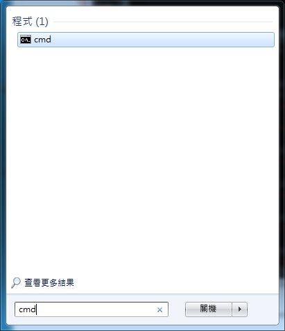
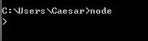

******************
Node.js 安裝與設定
******************

本篇將講解如何在各個不同OS建立NodeJS 環境，目前NodeJS 0.4.8版本環境架設方式需依賴Linux指令才可編譯完成，當然在不同作業系統中也已經有NodeJS package，可以直接使用指令快速架設。以下各不同作業系統解說如何安裝NodeJS。

Ubuntu Linux
============

更新：推薦使用 nvm。

::

    git clone git://github.com/creationix/nvm.git ~/.nvm
    echo ". ~/.nvm/nvm.sh" >> ~/.bashrc
    nvm install v0.6.14
    nvm alias default v0.6.14

以上可參考： http://dreamerslab.com/blog/tw/how-to-setup-a-node-js-development-environment-on-ubuntu-11-04/

使用 APT 套件管理工具是常見的方法，以下是使用社群提供的 PPA 安裝方式。

::
    
    sudo apt-get install python-software-properties
    sudo add-apt-repository ppa:chris-lea/node.js-devel
    sudo apt-get update
    sudo apt-get install nodejs

Other Linux
===========

Linux 很適合作為 NodeJS 的伺服器作業系統及開發環境。安裝前，請先確認以下套件已正確安裝。

* curl (wget) 用來下載檔案的工具
* git 先進的版本控制工具
* g++ GNU C++ 軟體編譯工具
* make GNU 軟體專案建置工具

安裝指令如下，如設有權限問題，請在指令前面加上sudo 

.. code-block:: javascript

    git clone https://github.com/joyent/node.git
    cd node
    git checkout v0.6.7
    ./configure
    make
    sudo make install 

接著測試nodeJS 是否正常執行

.. code-block:: javascript

    node --version

出現版本訊息即表示安裝成功。

.. image:: ../images/zh-tw/node_install_linux_node_test.jpg
   :scale: 100%
   :align: center

Windows
=======

nodeJS 在v0.6.0版本之後開始正式支援windows native，直接使用node.exe 就可以執行程式，支援性完全與linux 相同，更棒的部份就是不需經過編譯，經過下載之後，簡單設定完成，立即開發node 程式。

`下載node.js 安裝檔案 <http://nodejs.org/#download>`

如此完成windows native node.exe 安裝，接著可以進入command line 執行測試。在command line 輸指令如下

.. code-block:: javascript

    node -v

接著出現node.js 版本訊息畫面，表示安裝完成。

