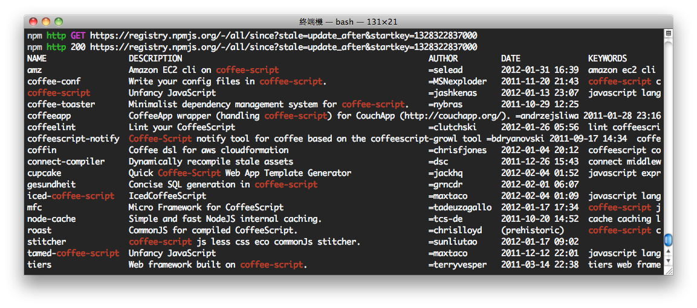

**************
NPM 套件管理工具
**************

npm 全名為 **N**\ ode **P**\ ackage **M**\ anager，\
是 Node.js 的套件（package）管理工具，
類似 Perl 的 ppm 或 PHP 的 PEAR 等。\
安裝 npm 後，\
使用 ``npm install module_name`` 指令即可安裝新套件，\
維護管理套件的工作會更加輕鬆。

npm 可以讓 Node.js 的開發者，\
直接利用、擴充線上的套件庫（packages registry），\
加速軟體專案的開發。\
npm 提供很友善的搜尋功能，\
可以快速找到、安裝需要的套件，\
當這些套件發行新版本時，\
npm 也可以協助開發者自動更新這些套件。

npm 不僅可用於安裝新的套件，它也支援搜尋、列出已安裝模組及更新的功能。

安裝 NPM
========

Node.js 在 0.6.3 版本開始內建 npm，\
讀者安裝的版本若是此版本或更新的版本，\
就可以略過以下安裝說明。

若要檢查 npm 是否正確安裝，可以使用以下的指令：

::

    npm -v

.. topic:: 執行結果說明

    若 npm 正確安裝，執行 ``npm -v`` 將會看到類似 1.1.0-2 的版本訊息。

若讀者安裝的 Node.js 版本比較舊，\
或是有興趣嘗試自己動手安裝 npm 工具，\
則可以參考以下的說明。

安裝於 Windows 系統
------------------

Node.js for Windows 於 0.6.2 版開始內建 npm，\
使用 nodejs.org 官方提供的安裝程式，\
不需要進一步的設定，\
就可以立即使用 npm 指令，\
對於 Windows 的開發者來說，\
大幅降低環境設定的問題與門檻。

除了使用 Node.js 內建的 npm，\
讀者也可以從 npm 官方提供的以下網址：

http://npmjs.org/dist/

這是由 npm 提供的 Fancy Windows Install 版本，\
請下載壓縮檔（例如：\ ``npm-1.1.0-3.zip``\ ），\
並將壓縮檔內容解壓縮至 Node.js 的安裝路徑（例如：\ ``C:\Program Files\nodejs``\ ）。

解壓縮後，在 Node.js 的安裝路徑下，應該有以下的檔案及資料夾。

* npm.cmd （檔案）
* node_modules （資料夾）

安裝於 Linux 系統
----------------

Ubuntu Linux 的使用者，\
可以加入 `NPM Unoffcial PPA <https://launchpad.net/~gias-kay-lee/+archive/npm>`_
這個 repository，\
即可使用 apt-get 完成 npm 安裝。

.. topic:: Ubuntu Linux 使用 apt-get 安裝 npm

    ::
    
        sudo apt-get install python-software-properties
        sudo add-apt-repository ppa:gias-kay-lee/npm
        sudo apt-get update
        sudo apt-get npm

npm 官方提供的安裝程式 ``install.sh``\ ，\
可以適用於大多數的 Linux 系統。\
使用這個安裝程式，請先確認：

1. 系統已安裝 curl 工具（請使用 ``curl --version`` 查看版本訊息）
2. 已安裝 Node.js 並且 PATH 正確設置
3. Node.js 的版本必須大於 0.4.x

以下為 npm 提供的安裝指令：

::

    curl http://npmjs.org/install.sh | sh

安裝成功會看到如下訊息：

.. topic:: install.sh 安裝成功的訊息

    ::

        npm@1.0.105 /home/USERNAME/local/node/lib/node_modules/npm
        It worked

安裝於 Mac OS X
---------------

建議採用與 Node.js 相同的方式，進行 npm 的安裝。\
例如使用 MacPorts 安裝 Node.js，\
就同樣使用 MacPorts 安裝 npm，\
這樣對日後的維護才會更方便容易。

使用 MacPorts 安裝 npm 是本書比較建議的方式，\
它可以讓 npm 的安裝、移除及更新工作自動化，\
將會幫助開發者節省寶貴時間。

.. topic:: 安裝 MacPorts 的提示

    在 MacPorts 網站，可以取得 OS X 系統版本對應的安裝程式（例如 10.6 或 10.7）。

    http://www.macports.org/

    安裝過程會詢問系統管理者密碼，使用預設的選項完成安裝即可。\
    安裝 MacPorts 之後，在終端機執行 ``port -v`` 將會看到 MacPorts 的版本訊息。

安裝 npm 之前，先更新 MacPorts 的套件清單，以確保安裝的 npm 是最新版本。

::

    sudo port -d selfupdate

接著安裝 npm。

::

    sudo port install npm

若讀者的 Node.js 並非使用 MacPorts 安裝，\
則不建議使用 MacPorts 安裝 npm，\
因為 MacPorts 會自動檢查並安裝相依套件，\
而 npm 相依 nodejs，\
所以 MacPorts 也會一併將 nodejs 套件安裝，\
造成先前讀者使用其它方式安裝的 nodejs 被覆蓋。

讀者可以先使用 MacPorts 安裝 curl（\ ``sudo port install curl``\ ），\
再參考 Linux 的 install.sh 安裝方式，\
即可使用 npm 官方提供的安裝程式。

NPM 安裝後測試
-------------

npm 是指令列工具（command-line tool），\
使用時請先打開系統的文字終端機工具。

測試 npm 安裝與設定是否正確，請輸入指令如下：

::

    npm -v

或是：

::

    npm --version

如果 npm 已經正確安裝設定，就會顯示版本訊息：

.. topic:: 執行結果（範例）

    ::

        1.1.0-2

使用 NPM 安裝套件
================

npm 目前擁有超過 6000 種套件（packages），\
可以在 `npm registry <http://search.npmjs.org/>`_ 使用關鍵字搜尋套件。

http://search.npmjs.org/

舉例來說，在關鍵字欄位輸入「coffee-script」，\
下方的清單就會自動列出包含 coffee-script 關鍵字的套件。

.. image:: ../images/zh-tw/node_npm_registry.png

接著我們回到終端機模式的操作，\
``npm`` 的指令工具本身就可以完成套件搜尋的任務。

例如，以下的指令同樣可以找出 coffee-script 相關套件。

::

    npm search coffee-script

以下是搜尋結果的參考畫面：

找到需要的套件後（例如 express），即可使用以下指令安裝：

::

    npm install coffee-script

值得注意的一點是，使用 ``npm install`` 會將指定的套件，\
安裝在工作目錄（Working Directory）的 ``node_modules`` 資料夾下。

以 Windows 為例，如果執行 ``npm install`` 的目錄位於：

``C:\project1``

那麼 npm 將會自動建立一個 node_modules 的子目錄（如果不存在）。

``C:\project1\node_modules``

並且將下載的套件，放置於這個子目錄，例如：

``C:\project1\node_modules\coffee-script``

這個設計讓專案可以個別管理相依的套件，\
並且可以在專案佈署或發行時，\
將這些套件（位於 node_modules）一併打包，\
方便其它專案的使用者不必再重新下載套件。

這個 ``npm install`` 的預設安裝模式為 **local**\ (本地)，\
只會變更當前專案的資料夾，\
不會影響系統。

另一種安裝模式稱為 **global**\ （全域），\
這種模式會將套件安裝到系統資料夾，\
也就是 npm 安裝路徑的 ``node_modules`` 資料夾，\
例如：

``C:\Program Files\nodejs\node_modules``

是否要使用全域安裝，\
可以依照套件是否提供\ **新指令**\ 來判斷，\
舉例來說，\
express 套件提供 ``express`` 這個指令，\
而 coffee-script 則提供 ``coffee`` 指令。

在 local 安裝模式中，這些指令的程式檔案，\
會被安裝到 ``node_modules`` 的 ``.bin`` 這個隱藏資料夾下。\
除非將 .bin 的路徑加入 PATH 環境變數，\
否則要執行這些指令將會相當不便。

為了方便指令的執行，\
我們可以在 ``npm install`` 加上 ``-g`` 或 ``--global`` 參數，\
啟用 global 安裝模式。例如：

::

    npm install -g coffee-script
    npm install -g express

使用 global 安裝模式，\
需要注意執行權限的問題，\
若權限不足，可能會出現類似以下的錯誤訊息：

::

    npm ERR! Error: EACCES, permission denied '...'
    npm ERR! 
    npm ERR! Please try running this command again as root/Administrator.

要獲得足夠得執行權限，請參考以下說明：

* Windows 7 或 2008 以上，在「命令提示字元」的捷徑按右鍵，\
  選擇「以系統管理員身分執行」，\
  執行 npm 指令時就會具有 Administrator 身分。
* Mac OS X 或 Linux 系統，可以使用 ``sudo`` 指令，例如：\
  
  ``sudo npm install -g express``
* Linux 系統可以使用 root 權限登入，或是以「\ ``sudo su -``\ 」切換成 root 身分。\
  （使用 root 權限操作系統相當危險，因此並不建議使用這種方式。）

若加上 ``-g`` 參數，使用 ``npm install -g coffee-script`` 完成安裝後，\
就可以在終端機執行 ``coffee`` 指令。例如：

::

    coffee -v

.. topic:: 執行結果（範例）

    ::

        CoffeeScript version 1.2.0

套件的更新及維護
==============

除了前一節說明的 search 及 install 用法，\
npm 還提供其他許多指令（commands）。

使用 ``npm help`` 可以查詢可用的指令。

::

    npm help

.. topic:: 執行結果（部分）

    ::

        where <command> is one of:
            adduser, apihelp, author, bin, bugs, c, cache, completion,
            config, deprecate, docs, edit, explore, faq, find, get,
            help, help-search, home, i, info, init, install, la, link,
            list, ll, ln, login, ls, outdated, owner, pack, prefix,
            prune, publish, r, rb, rebuild, remove, restart, rm, root,
            run-script, s, se, search, set, show, star, start, stop,
            submodule, tag, test, un, uninstall, unlink, unpublish,
            unstar, up, update, version, view, whoami

使用 ``npm help command`` 可以查詢指令的詳細用法。例如：

::

    npm help list

接下來，本節要介紹開發過程常用的 npm 指令。

使用 ``list`` 可以列出已安裝套件：

::

    npm list

.. topic:: 執行結果（範例）

    ::

        ├── coffee-script@1.2.0 
        └─┬ express@2.5.6 
          ├─┬ connect@1.8.5 
          │ └── formidable@1.0.8 
          ├── mime@1.2.4 
          ├── mkdirp@0.0.7 
          └── qs@0.4.1 

檢視某個套件的詳細資訊，例如：

::

    npm show express

升級所有套件（如果該套件已發佈更新版本）：

::

    npm update

升級指定的套件：

::

    npm update express

移除指定的套件：

::

    npm uninstall express

使用 package.json
=================

對於正式的 Node.js 專案，\
可以建立一個命名為 ``package.json`` 的設定檔（純文字格式），\
檔案內容參考範例如下：

.. topic:: package.json（範例）

    ::

        {
            "name": "application-name"
          , "version": "0.0.1"
          , "private": true
          , "dependencies": {
              "express": "2.5.5"
            , "coffee-script": "latest"
            , "mongoose": ">= 2.5.3"
          }
        }

其中 ``name`` 與 ``version`` 依照專案的需求設置。

需要注意的是 ``dependencies`` 的設定，\
它用於指定專案相依的套件名稱及版本：

* ``"express": "2.5.5"``
  
  //代表此專案相依版本 2.5.5 的 express 套件
* ``"coffee-script": "latest"``
  
  //使用最新版的 coffee-script 套件（每次更新都會檢查新版）
* ``"mongoose": ">= 2.5.3"``
  
  //使用版本大於 2.5.3 的 mongoose 套件

假設某個套件的新版可能造成專案無法正常運作，\
就必須指定套件的版本，\
避免專案的程式碼來不及更新以相容新版套件。\
通常在開發初期的專案，\
需要盡可能維持新套件的相容性（以取得套件的更新或修正），\
可以用「\ ``>=``\ 」設定最低相容的版本，\
或是使用「\ ``latest``\ 」設定永遠保持最新套件。
