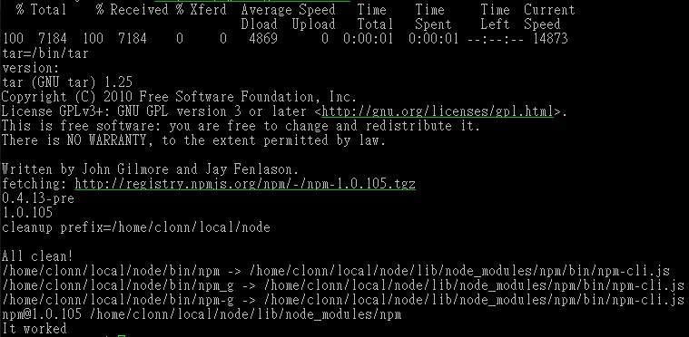
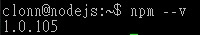
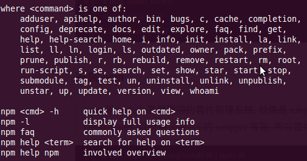

********
NPM 介紹 
********

npm 全名為 **N**ode **P**ackage **M**anager，\
是 Node.js 的模組（modules）管理工具，
類似 gem、apt-get 等。\
安裝 npm 後，\
使用 ``npm install module_name`` 指令即可安裝新模組，
維護管理模組的工作會更加輕鬆。\

npm 不僅可用於安裝新的模組，它也支援搜尋、列出已安裝模組及更新的功能。

安裝 NPM
========

Node.js 在 0.6.3 版本開始內建 npm，\
讀者安裝的版本若是此版本或更新的版本，\
就可以略過以下安裝說明。

若要檢查 npm 是否正確安裝，可以使用以下的指令：

::

    npm -v

.. topic:: 執行結果說明

    若 npm 正確安裝，執行 ``npm -v`` 將會看到類似 1.1.0-2 的版本訊息。

若讀者安裝的 Node.js 版本比較舊，\
或是有興趣嘗試自己動手安裝 npm 工具，\
則可以參考以下的說明。

Windows 安裝
============

Node.js for Windows 於 0.6.2 版開始內建 npm，\
使用 nodejs.org 官方提供的安裝程式，\
不需要進一步的設定，\
就可以立即使用 npm 指令，\
對於 Windows 的開發者來說，\
大幅降低環境設定的問題與門檻。

除了使用 Node.js 內建的 npm，\
讀者也可以從 npm 官方提供的以下網址：

http://npmjs.org/dist/

這是由 npm 提供的 Fancy Windows Install 版本，\
請下載壓縮檔（例如：\ ``npm-1.1.0-3.zip``\ ），\
並將壓縮檔內容解壓縮至 Node.js 的安裝路徑（例如：\ ``C:\Program Files\nodejs``\ ）。

解壓縮後，在 Node.js 的安裝路徑下，應該有以下的檔案及資料夾。

* npm.cmd （檔案）
* node_modules （資料夾）

Linux 安裝
==========

安裝npm 之前必須安裝 curl，同時確認node 已經安裝完成，環境變數也設定完成，node 版本需為 v0.4.x 以上，底下為安裝指令。

curl http://npmjs.org/install.sh | sh

安裝完成後會看到如下圖

接著輸入指令測試

.. code-block:: javascript

    npm --v

npm 指令測試
============

windows 就必須進入command line，linux 需要進入到terminal 模式底下，輸入指令如下，

.. code-block:: javascript

    npm --v

結果如下圖所示,

